<div align="center">

# Отчёт

</div>

<div align="center">

## Практическая работа №13

</div>

<div align="center">

## Обработка жестов

</div>

**Выполнил:** Деревянко Артём Владимирович<br>
**Курс:** 2<br>
**Группа:** ИНС-б-о-24-2<br>
**Направление:** 09.03.02 Информационные системы и технологии<br>
**Проверил:** Потапов Иван Романович

---

### Цель работы
Изучить механизмы обработки сенсорных жестов в Android. Научиться создавать собственные обработчики для распознавания свайпов (смахиваний) и других движений пальца по экрану. Интегрировать обработку жестов в игровое приложение, разрабатываемое в рамках практических работ.

### Ход работы
#### Задание 1: Создание проекта и подготовка интерфейса
1. Был открыт Android Studio и создан новый проект с шаблоном **Empty Views Activity**. Проекту дано имя `Lab_13`. Пересены все основные активности и разметки из проекта, созданного в прошлой практической работе.
2. Создана новая разметка `activity_swipe.xml` с элементом `ImageView`, который будет реагировать на жесты.
##### activity_swipe.xml
```xml
<?xml version="1.0" encoding="utf-8"?>
<LinearLayout xmlns:android="http://schemas.android.com/apk/res/android"
    android:layout_width="match_parent"
    android:layout_height="match_parent"
    android:orientation="vertical"
    android:gravity="center"
    android:padding="16dp">

    <TextView
        android:layout_width="wrap_content"
        android:layout_height="wrap_content"
        android:text="Сделайте свайп по квадрату"
        android:textSize="18sp"
        android:layout_marginBottom="24dp"/>

    <ImageView
        android:id="@+id/rect"
        android:layout_width="150dp"
        android:layout_height="150dp"
        android:background="#4CAF50"
        android:layout_gravity="center"
        android:layout_marginBottom="32dp" />

</LinearLayout>
```

#### Задание 2: Создание класса OnSwipeTouchListener
1. В проекте создан новый Java-класс с именем `OnSwipeTouchListener`.
2. В нём реализован интерфейс `View.OnTouchListener` и добавлен внутренний класс `GestureListener`, наследующий от `GestureDetector.SimpleOnGestureListener`, как показано в теоретической части.
3. Конструктор класса принимает `Context` и создаёт `GestureDetector`.
4. Переопределены методы `onSwipeRight()`, `onSwipeLeft()`, `onSwipeTop()`, `onSwipeBottom()` как пустые.
##### OnSwipeTouchListener
```java
package com.example.lab_13;

import android.content.Context;
import android.view.GestureDetector;
import android.view.MotionEvent;
import android.view.View;

public class OnSwipeTouchListener implements View.OnTouchListener {
    private final GestureDetector gestureDetector;

    public OnSwipeTouchListener(Context context) {
        gestureDetector = new GestureDetector(context, new GestureListener());
    }

    @Override
    public boolean onTouch(View v, MotionEvent event) {
        return gestureDetector.onTouchEvent(event);
    }

    private final class GestureListener extends GestureDetector.SimpleOnGestureListener {
        private static final int SWIPE_THRESHOLD = 100; // минимальное расстояние для свайпа
        private static final int SWIPE_VELOCITY_THRESHOLD = 100; // минимальная скорость

        @Override
        public boolean onDown(MotionEvent e) {
            return true; // необходимо вернуть true, чтобы другие события обрабатывались
        }

        @Override
        public boolean onFling(MotionEvent e1, MotionEvent e2, float velocityX, float velocityY) {
            boolean result = false;
            try {
                float diffY = e2.getY() - e1.getY();
                float diffX = e2.getX() - e1.getX();
                if (Math.abs(diffX) > Math.abs(diffY)) {
                    // Горизонтальный свайп
                    if (Math.abs(diffX) > SWIPE_THRESHOLD && Math.abs(velocityX) > SWIPE_VELOCITY_THRESHOLD) {
                        if (diffX > 0) {
                            onSwipeRight();
                        } else {
                            onSwipeLeft();
                        }
                        result = true;
                    }
                } else {
                    // Вертикальный свайп
                    if (Math.abs(diffY) > SWIPE_THRESHOLD && Math.abs(velocityY) > SWIPE_VELOCITY_THRESHOLD) {
                        if (diffY > 0) {
                            onSwipeBottom();
                        } else {
                            onSwipeTop();
                        }
                        result = true;
                    }
                }
            } catch (Exception e) {
                e.printStackTrace();
            }
            return result;
        }
    }

    // Методы, которые можно переопределить в классе-наследнике или анонимно
    public void onSwipeRight() { }
    public void onSwipeLeft() { }
    public void onSwipeTop() { }
    public void onSwipeBottom() { }
}
```

#### Задание 3: Применение обработчика жестов
1. В созданной `SwipeActivity` получена ссылка на View, который будет отслеживать жесты.
2. На него установлен экземпляр `OnSwipeTouchListener` с анонимной реализацией методов-обработчиков.
##### SwipeActivity
```java
package com.example.lab_13;

import android.os.Bundle;
import android.widget.ImageView;
import android.widget.Toast;
import androidx.appcompat.app.AppCompatActivity;

public class SwipeActivity extends AppCompatActivity {

    private ImageView imageView;

    @Override
    protected void onCreate(Bundle savedInstanceState) {
        super.onCreate(savedInstanceState);
        setContentView(R.layout.activity_swipe);

        imageView = findViewById(R.id.rect);

        // Устанавливаем обработчик свайпов
        imageView.setOnTouchListener(new OnSwipeTouchListener(this) {
            @Override
            public void onSwipeRight() {
                Toast.makeText(SwipeActivity.this, "Свайп вправо", Toast.LENGTH_SHORT).show();
                // Например, перемещаем объект вправо
                imageView.setX(imageView.getX() + 100);
            }

            @Override
            public void onSwipeLeft() {
                Toast.makeText(SwipeActivity.this, "Свайп влево", Toast.LENGTH_SHORT).show();
                imageView.setX(imageView.getX() - 100);
            }

            @Override
            public void onSwipeTop() {
                Toast.makeText(SwipeActivity.this, "Свайп вверх", Toast.LENGTH_SHORT).show();
                imageView.setY(imageView.getY() - 100);
            }

            @Override
            public void onSwipeBottom() {
                Toast.makeText(SwipeActivity.this, "Свайп вниз", Toast.LENGTH_SHORT).show();
                imageView.setY(imageView.getY() + 100);
            }
        });
    }
}
```

#### Задание 4: Тестирование и настройка чувствительности
Приложение было запущено. При выполнении свайпов в разные стороны по квадрату, квадрат перемещается.<br>
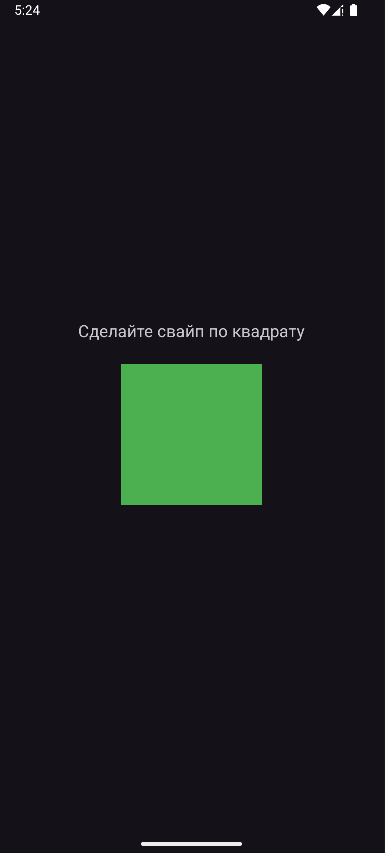<br>
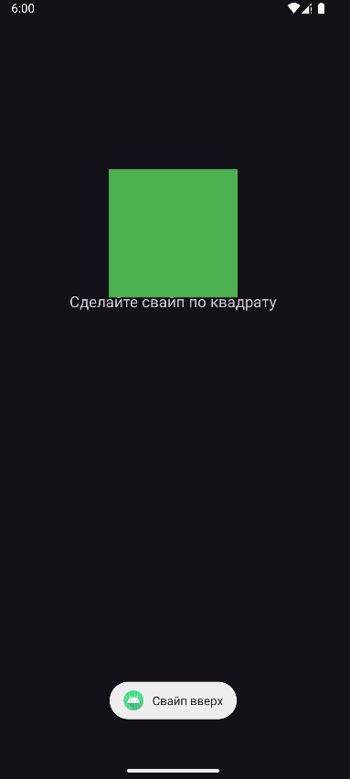<br>
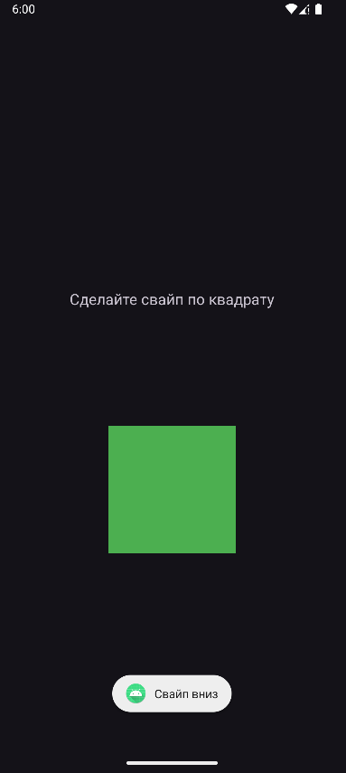<br>
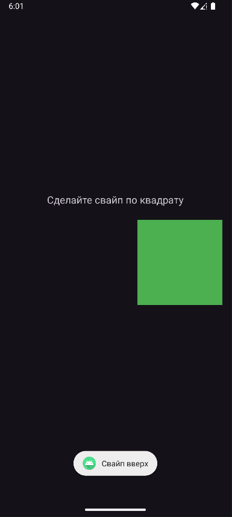<br>
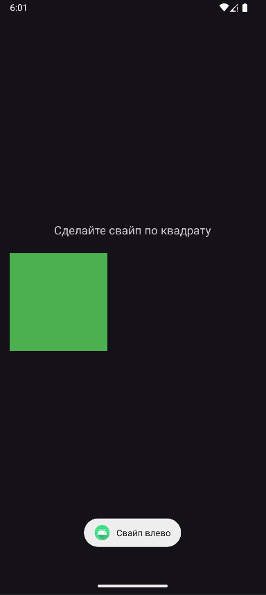

#### Задания для самостоятельного выполнения
**Вариант 11. Волк ловит яйца**
##### Часть 1. Интеграция в игровое приложение
Реализована обработка жестов для управления волком:
- Свайп вверх (`onSwipeTop()`) - перемещение в позицию выше
- Свайп вниз (`onSwipeBottom()`) - перемещение в позицию ниже
- Свайп влево (`onSwipeLeft()`) - перемещение в позицию левее
- Свайп вправо (`onSwipeRight()`) - перемещение в позицию правее
##### Часть 2. Дополнительные жесты
Реализована обработка дополнительных жестов:
- Долгое нажатие (`onLongPress()`) - начало новой игры
- Двойное касание (`onDoubleTap()`) - управление паузой
##### Часть 3. Визуальная обратная связь
Чтобы пользователь понимал, что жест распознан, `gameStatus` меняет своё содержимое в зависимости от действия (например, если свайп вверх, то `gameStatus.setText("⬆️ Вверх")`).<br>
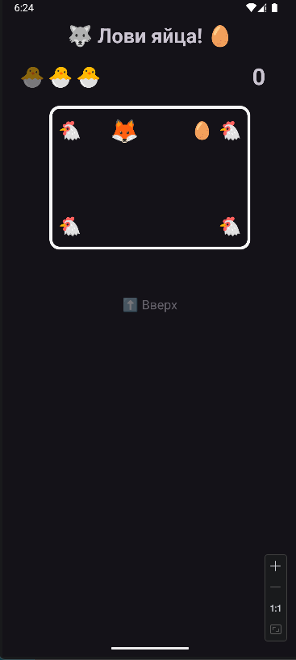<br>
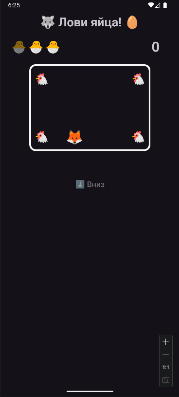<br>
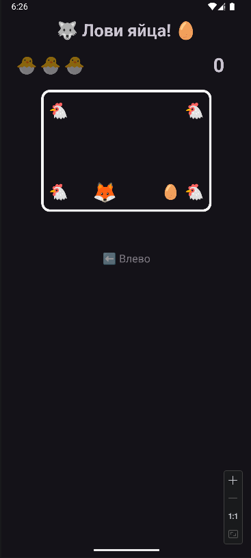<br>
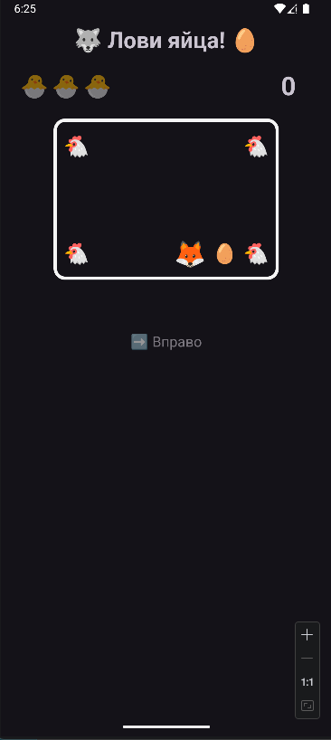<br>
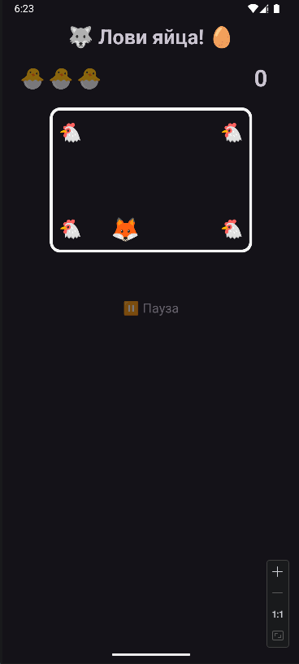<br>
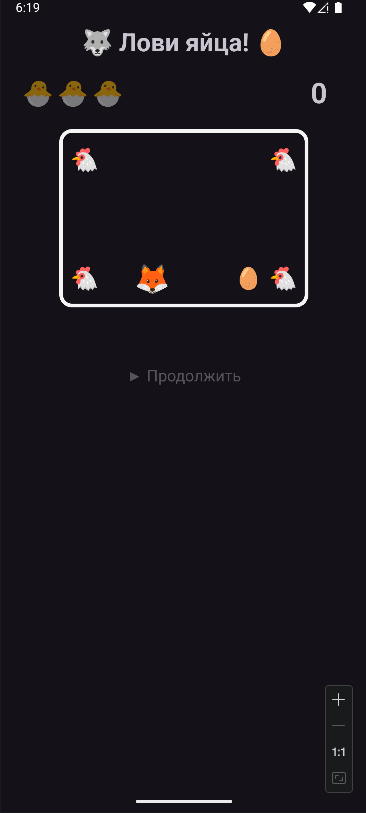<br>
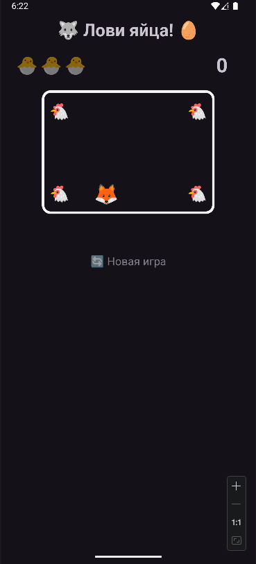

### Вывод
В результате выполнения практической работы были изучены механизмы обработки сенсорных жестов в Android. Получены навыки создания собственных обработчиков для распознавания свайпов (смахиваний) и других движений пальца по экрану. Обработка жестов интегрирована в игровое приложение, разрабатываемое в рамках практических работ.

### Ответы на контрольные вопросы
1. **Что такое MotionEvent? Какие основные типы событий (actions) в нём существуют?**<br>
MotionEvent — это класс, содержащий информацию о сенсорном событии (касании, движении, отпускании). Основные типы событий (actions):
- `ACTION_DOWN` — палец коснулся экрана
- `ACTION_MOVE` — палец движется по экрану
- `ACTION_UP` — палец отпущен
- `ACTION_CANCEL` — событие прервано системой

---

2. **Для чего используется класс GestureDetector? В чём его преимущество перед обработкой сырых MotionEvent?**<br>
`GestureDetector` используется для распознавания сложных жестов (свайпы, долгие нажатия, двойные касания). Преимущество: он автоматически анализирует последовательность сенсорных событий и вызывает соответствующие методы слушателя, избавляя разработчика от необходимости вручную отслеживать координаты, скорость и время между событиями.

---

3. **Какой метод GestureDetector отвечает за распознавание быстрого смахивания (свайпа)? Какие параметры он принимает?**<br>
Метод `onFling(MotionEvent e1, MotionEvent e2, float velocityX, float velocityY)`, где:
- `e1` — событие начального касания
- `e2` — событие конечного касания
- `velocityX` — скорость движения по оси X
- `velocityY` — скорость движения по оси Y

---

4. **Зачем в методе onDown() необходимо возвращать true?**<br>
Возврат `true` в методе `onDown()` сигнализирует системе, что обработчик заинтересован в получении последующих событий этого жеста. Если вернуть `false`, остальные методы (onFling, onLongPress и др.) не будут вызваны.

---

5. **Как отличить горизонтальный свайп от вертикального? Какие параметры для этого используются?**<br>
Сравнивают абсолютные значения разницы координат:
- `diffX = e2.getX() - e1.getX()` — смещение по горизонтали
- `diffY = e2.getY() - e1.getY()` — смещение по вертикали<br>
Если `Math.abs(diffX) > Math.abs(diffY)` — свайп горизонтальный, иначе — вертикальный.

---

6. **Что такое пороговые значения (threshold) и зачем они нужны при распознавании жестов?**<br>
Пороговые значения (threshold) — это минимальные параметры жеста (расстояние, скорость), которые должны быть превышены для его распознавания. Они нужны для фильтрации случайных движений и ложных срабатываний. Примеры: `SWIPE_THRESHOLD` (минимальное расстояние), `SWIPE_VELOCITY_THRESHOLD` (минимальная скорость).

---

7. **Как заставить View реагировать на сенсорные события? Какой слушатель для этого используется?**<br>
Необходимо установить на View слушатель `View.OnTouchListener` с помощью метода `setOnTouchListener()`. В этом слушателе переопределяется метод `onTouch(View v, MotionEvent event)`, который будет вызываться при каждом сенсорном событии.

---

8. **Какие ещё жесты можно распознать с помощью GestureDetector? Назовите не менее трёх.**
- `onSingleTapUp()` — одиночное краткое касание
- `onLongPress()` — долгое нажатие
- `onDoubleTap()` — двойное касание
- `onScroll()` — прокрутка (перемещение пальца после касания)
- `onShowPress()` — нажатие без движения (для визуальной обратной связи)